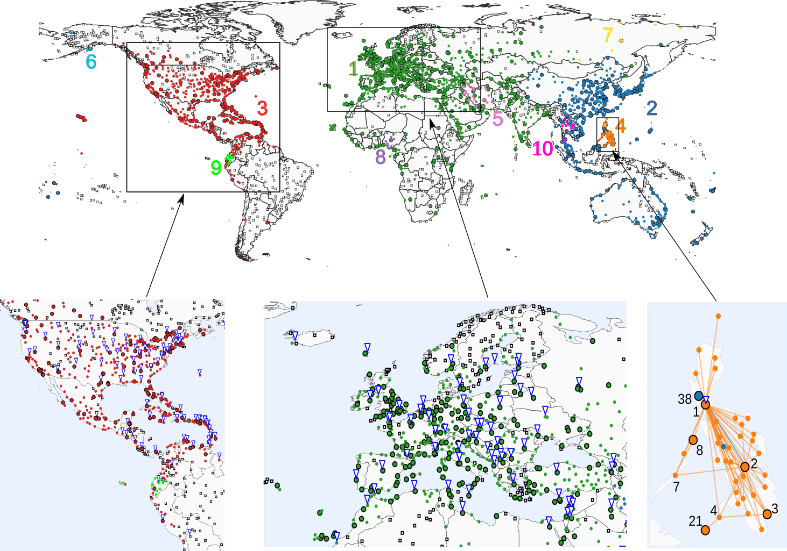

=======================
Overview of cpalgorithm
=======================

cpalgorithm is a Python package for finding core-periphery structure in networks.

cpalgorithm provides:
 
* various algorithms for finding single or multiple core-periphery pairs in networks, and
* statistical tests for detected core-periphery structure.

Despite the importance of core-periphery structure, a few software implements core-periphery detection algorithms. 
In many cases, authors provide the code for their algorithms independently. 
The aim of cpalgorithm is to provide an access to the algorithms, making the analysis of core-periphery structure easier. 

========================
Core-periphery structure
========================

Core-periphery structure is a mesoscale structure of networks, where a core is a group of densely interconnected nodes, and a periphery is a group of sparsely interconnected nodes. 
The core can be densely interconnected with the periphery or not.
Core-periphery structure has been found in various empirical networks such as social networks, biological networks and transportation networks [1].
For example, a political blog network [2] consists of two core-periphery pairs, each of which consists of the blogs sharing the same political agenda [3,4].
Each core-periphery pair consists of a set of core blogs that are linking each other and a set of peripheral blogs that links mainly to the core blogs.  

.. figure:: fig/poliblog.png
   :scale: 40 %
   :align: center

   Core-periphery structure in the political blog network. 
   The filled or open circles indicate core nodes or peripheral nodes, respectively.  
   The colour of each circle indicates the core-periphery pair to which the node belongs.

In the worldwide airport network [5], there are 28 core-periphery pairs, each of which mostly consists of the airports in the same geographical region [3,4].
The core and peripheral ports largely correspond to the hubs and regional airports. 

   Core-periphery structure in the worldwide airport networks. 
   The circles with or without a black stroke indicate core nodes or peripheral nodes, respectively.  
   The colour of each circle indicates the core-periphery pair to which the node belongs.
   Open squares indicate the residual ports that do not belong to any core-periphery pair. 

Core-periphery structure may play a crucial role in complex systems.
For example, core-periphery structure is the most robust structure against random attacks to nodes [6]. 
Transportation networks with core-periphery structure are economically efficient [7].

References
----------

- [1] P. Csermely, A. London, L.-Y. Wu, and B. Uzzi, J. Complex Netw. 1, 93 (2013).
- [2] L. A. Adamic and N. Glance, in Proceedings of the 3rd International Workshop on Link Discovery (ACM, New York, 2005), pp. 36–43.
- [3] S. Kojaku and N. Masuda, Phys. Rev. 96, 052313 (2017).
- [4] S. Kojaku and N. Masuda, N. J. Phys. 20, 043012 (2018).
- [5] T. Opsahl, “Why Anchorage is not (that) impor- tant: Binary ties and sample selection” (2011) [https://toreopsahl.com/2011/08/12/why-anchorage-is-not- that-important-binary-ties-and-sample-selection]. 
- [6] T. Peixoto and S. Bornholdt, Phys. Rev. Lett. 109, 118793 (2012) 
- [7] T. Verma, F. Russmann, N. A. M. Araújo, J. Nagler, and H. J. Herrmann, Nat. Commun. 7, 10441 (2016).

========================
Scope
========================

Among various algorithms, cpalgorithm focuses density-based core-periphery structure.
Other types of core-periphery structure such as transportation-based core-periphery structure is left for future update.

 
.. toctree::
   :maxdepth: 2 
   :caption: Contents:

   Installation 
   Tutorial 
   Examples
   Reference 

Indices and tables
==================

* :ref:`genindex`
* :ref:`modindex`
* :ref:`search`
